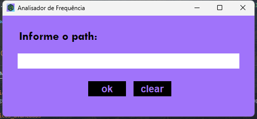

# Instruções de execução do programa

## 1º instalar o python 

https://www.python.org/downloads/

Obs: Este projeto não utiliza bibliotecas pip externas
sendo assim não é necessário instalar nada a mais

## Arquivos

Existem 3 formas de executar o programa, por interface gráfica no windows, através do executável. Por cli e por meio de jupyter notebook (porém não é possível executar de forma online, uma vez que altera diretórios)

Sendo assim, escolher o formato que quer 
* GUI para windows;
    > código fonte (main) app.py 
    > executar o script ocasionará um erro uma vez que o caminho de arquivos de imagens foi trocado, é necessário pegar o endereço da pasta ./img substituir nos 2 arquivos de imagem
            
            
    > o executável funciona corretamente, sem necessiade de alterar o path 

* CLI;

    > basta executar o arquivo app_cli por um editor de código 

    > ou no windows, pelo terminal python app_cli.py
    ~~~bash
    python app_cli.py
    ~~~
    > no linux e/ou mac python3 app_cli.py
     ~~~bash
    python3 app_cli.py
    ~~~
* Jupyter Notebook

    > Para o jupyter notebook é necessário instalar as extensões jupyter e ter o python instalado

